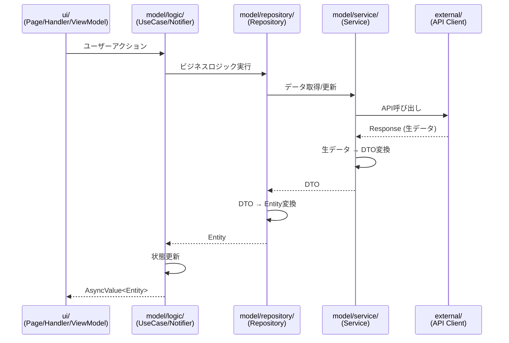

# flutter_architecture

## ディレクトリ構造

```
.
.
├── external
│   └── shared_preferences
│       ├── shared_preferences_client.dart
│       └── shared_preferences_client.g.dart
├── model
│   ├── entity
│   │   └── feature
│   │       ├── children.dart
│   │       ├── children.freezed.dart
│   │       └── user.dart
│   ├── logic
│   ├── repository
│   │   └── feature
│   │       └── account
│   │           ├── account_children.repository.dart
│   │           └── account_children.repository.g.dart
│   └── service
│       ├── feature
│       │   └── children
│       │       ├── children_dto.dart
│       │       ├── children_dto.freezed.dart
│       │       ├── children_dto.g.dart
│       │       ├── children_service.dart
│       │       └── children_service.g.dart
│       └── util
│           └── shared_preferences
│               └── shared_preferences_helper.dart
├── ui
│   ├── page
│   │   └── account
│   │       ├── account_child_detail_page
│   │       │   ├── account_child_detail_page_handler.dart
│   │       │   ├── account_child_detail_page_handler.g.dart
│   │       │   ├── account_child_detail_page_view_model.dart
│   │       │   ├── account_child_detail_page_view_model.freezed.dart
│   │       │   ├── account_child_detail_page_view_model.g.dart
│   │       │   └── account_child_detail_page.dart
│   │       ├── account_child_edit_page
│   │       │   ├── account_child_edit_page_handler.dart
│   │       │   ├── account_child_edit_page_handler.g.dart
│   │       │   ├── account_child_edit_page_view_model.dart
│   │       │   ├── account_child_edit_page_view_model.freezed.dart
│   │       │   ├── account_child_edit_page_view_model.g.dart
│   │       │   └── account_child_edit_page.dart
│   │       ├── account_child_register_page
│   │       │   ├── account_child_register_page_handler.dart
│   │       │   ├── account_child_register_page_handler.g.dart
│   │       │   └── account_child_register_page.dart
│   │       ├── account_page
│   │       │   ├── account_page_view_model.dart
│   │       │   ├── account_page_view_model.freezed.dart
│   │       │   ├── account_page_view_model.g.dart
│   │       │   └── account_page.dart
│   │       └── account_child_form.dart
│   ├── routing
│   │   ├── router_path.dart
│   │   └── router.dart
│   └── shared
│       ├── functional
│       └── functionless
│           ├── common_button.dart
│           ├── common_date_picker.dart
│           ├── common_select_box.dart
│           └── common_text_field.dart
├── util
└── main.dart
```



## external

- 外界との通信を担当する層です。（設定なども行う）
- 基本は service から参照される
- 例外もある（Flutter エントリーポイントで使う場合や、main でモバイルアプリの世界に入る入り口で使う場合などもある）

## model

### logic

- UseCase や Notifier が定義される
- Notifier・・・repository または useCase を使用する/アプリケーション全体で管理する状態
- UseCase・・・複数の repository を参照する複雑なロジックの作成
- UI のことは知らない（FLutter は出てこない）
- feature ごとに分ける

### entity

- アプリケーションで使用される型（Entity）を定義する
- feature ごとに分ける
- ドメインオブジェクトなのでデータ変換以外のメソッドを持つことがある

### repository

- ビジネスロジック
- service 層との通信を行う層
- DTO <-> Entity の変換を行う

### service

- ビジネスロジック
- external 層との通信を行う層
- repository から参照される
- feature ごとに分ける
- DTO を定義する
- 外部データを DTO へ変換

## ui

### page

- BuildContext OK
- WidgetRef OK
- ハンドル操作は pageHandler を呼び出す

#### handler

- BuildContext OK
- page 内で行われるすべての内容が public メソッドに現れる
- 処理呼び出し、エラーハンドリングなどの UI 操作・・・これ viewModel??

#### viewModel

- BuildContext NG
- ライフサイクルが Page と一致する
- Page のローディング・エラー・データ取得完了 (AsyncValue) を管理
- page に必要な state を一つのクラスとして freezed で定義
- この state を管理する Notifier を定義する

### shared

共通 Widget

#### functional

- いろんな画面に出てくるグローバルな状態（≒ 通信が必要）と紐づくもの（特定のページとの紐づきが少ないもの）
- WidgetRef OK

#### functionless

- WidgetRef NG
