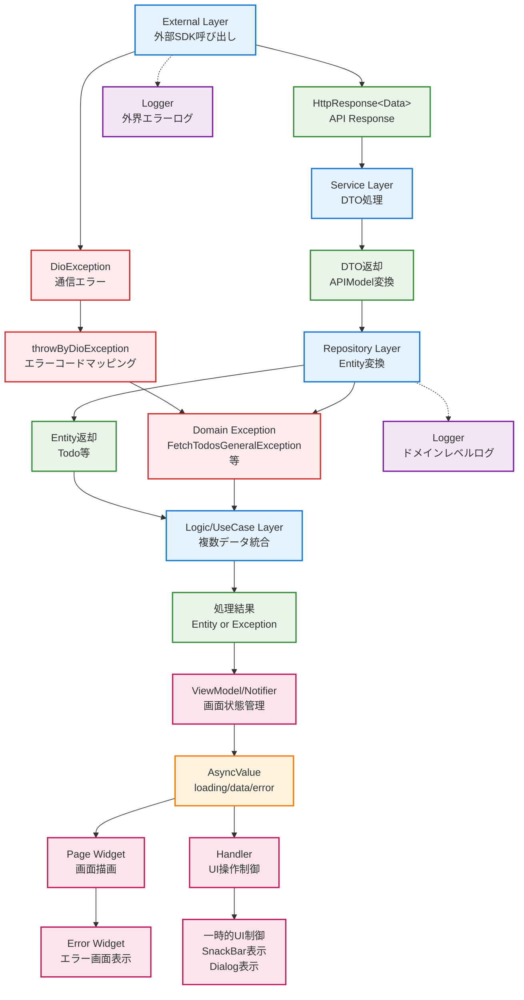

# エラーハンドリング

## external

- Result 型を return する
- HttpClient など 外部サービス固有の情報が必要な場合は専用の Result 型を定義して（例：HttpResponse 型） return する
- external な 3rd party sdk で起きたエラーの理由がわかる情報を失敗 Result 含める（例：Object e, Http status code）
- 3rd party sdk で取り扱っているすべてのエラー種別を網羅すべき必要はない

## service

- external 層との通信を行い、DTO を返す
- エラーハンドリングは基本的に repository 層に委譲

## entity

- クライアントアプリが取り扱いたいエラーの概念を Exception クラスとして定義
- ビジネスドメインに応じた具体的なエラー型を定義

```dart
/// Todo一覧の取得に関する400エラー例外。
class FetchTodos400Exception implements Exception {}

/// Todoの一般的な取得エラー例外。
class FetchTodosGeneralException implements Exception {}

/// Todoが見つからない場合の例外。
class FetchTodoNotFoundException implements Exception {}

/// Todo作成の一般的なエラー例外。
class CreateTodoGeneralException implements Exception {}

/// Todo更新時に対象が見つからない場合の例外。
class UpdateTodoNotFoundException implements Exception {}

/// Todo更新の一般的なエラー例外。
class UpdateTodoGeneralException implements Exception {}

/// Todo削除時に対象が見つからない場合の例外。
class DeleteTodoNotFoundException implements Exception {}

/// Todo削除の一般的なエラー例外。
class DeleteTodoGeneralException implements Exception {}
```

## repository

- return する値はクライアントアプリが取り扱いたいエラーの概念（Entity 層で定義した Exception）
- 3rd party sdk の情報（DioException など）を外部に漏らさない
- DioException を処理する共通ユーティリティ（`throwByDioException`）を使用
- エラーコードに基づいて適切なドメイン例外にマッピング

```dart
class TodoRepository {
  /** 省略 */
  Future<List<Todo>> fetchTodos() async {
    try {
      /** 省略 */
    } on DioException catch (e) {
      throwByDioException(
        e,
        onErrorCode: (errorCode) {
          switch (errorCode) {
            case 'endpoint.getTodos.fetchFailed.1':
              throw FetchTodos400Exception();
            default:
              throw FetchTodosGeneralException();
          }
        },
      );
    } catch (e) {
      throw FetchTodosGeneralException();
    }
  }
}
```

### Repository ユーティリティ

```dart
/// DioException を受け取って適切な例外をスローする関数。
Never throwByDioException(
  DioException e, {
  Never Function(String errorCode)? onErrorCode,
}) {
  /** 省略 */
  // エラーコードによるハンドリングを行う。
  onErrorCode(errorCode);
}

/// Repository 層からスローされる一般的または、未知の例外。
class RepositoryException implements Exception {}
```

## logic/useCase

- repository 層で定義された Exception をそのまま扱う
- 必要に応じて複数の repository からのエラーを統合

## viewModel, logic/Notifier

- repository 層または logic/useCase 層でスローされた Exception を AsyncValue で管理
- エラー状態を画面に適した形で保持

## handler

- repository 層または logic/useCase 層でスローされた Exception 型から UI に適したエラー状態に変換
- viewModel 層の場合は viewModel のエラー状態を参照する
- 一時的な UI 制御（SnackBar、Dialog 等）を行う際に利用する

```dart
class TodoPageHandler {
  /** 省略 */
  Future<void> addTodo() async {
    try {
      await _ref.read(todoRepositoryProvider).createTodo(/** 省略 */);
    } catch (e) {
      if (e is CreateTodoGeneralException) {
        showDialog(/** 省略 */);
      } else {
        showDialog(/** 省略 */);
      }
    }
  }
}
```

## page

- スローされた Exception 型から UI に適したエラー状態に変換
- エラーウィジェットを表示する

```dart
/** 省略 */
ref.watch(todosPageViewModelProvider).when(
    /** 省略 */
    error: (e, stack) {
        if (e is FetchTodosException) {
            return Text("Todo一覧の取得に失敗しました");
        }
        return Text("画面表示に失敗しました");
    }
)
```

## ログの方針

- external 層で外界のエラーログを送る
- repository 層でドメインレベルのエラーを送る

## エラーフロー図

