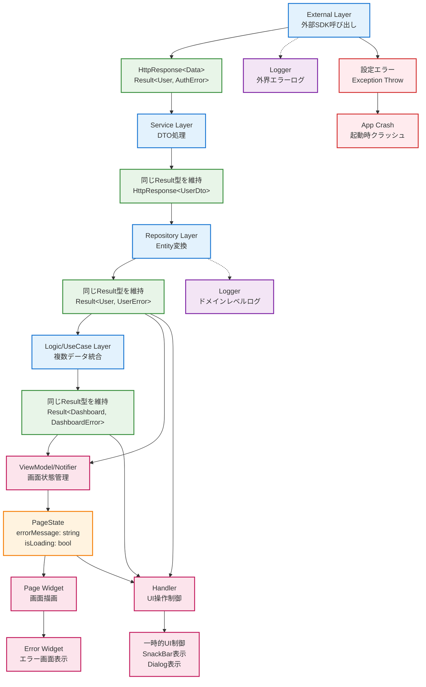

# エラーハンドリング

## external

- Result 型を return する
- HttpClient など 外部サービス固有の情報が必要な場合は専用の Result 型を定義して（例：HttpResponse 型） return する
- external な 3rd party sdk で起きたエラーの理由がわかる情報を失敗 Result 含める（例：Object e, Http status code）
- 3rd party sdk で取り扱っているすべてのエラー種別を網羅すべき必要はない

## service

-

## entity

- クライアントアプリが取り扱いたいエラーの概念

```dart
/// Todoの追加の際にタイトルがない場合スローされる例外。
class AddTodoMissingTitleException implements Exception {}

/// Todoの追加に失敗した際にスローされる例外。
class AddTodoException implements Exception {}
```

## repository

- return する値はクライアントアプリが取り扱いたいエラーの概念（Entity）や Exception = 3rd party sdk の情報を含めるべきでない

```dart
class TodoRepository {
  /** 省略 */
  Future</** 省略 */> addTodo(/** 省略 */) async {
    try{}..
    /** 省略 */
    throw AddTodoMissingTitleException();

    /** 省略 */
    throw AddTodoException();
  }
}
```

## logic/useCase

## viewModel,logic/Notifier

## handler

- repository 層 または logic/useCase 層で スローされた Exception 型から UI に適したエラー状態に変換する
- viewModel 層の場合は viewModel のエラー状態を参照する
- 一時的な UI 制御（SnackBar、Dialog 等）を行う際に利用する

```dart
class TodosPageHandler {
  /** 省略 */
  Future</** 省略 */> addTodo(/** 省略 */) async {
    /** 省略 */
    try {
        _ref.read(todoRepositoryProvider).addTodo(/** 省略 */);
    } catch (e) {
        if (e is AddTodoException) {
            showDialog(/** 省略 */);
        }
         showDialog(/** 省略 */);
    }
  }
}
```

## page

- スローされた Exception 型から UI に適したエラー状態に変換する
- エラーウィジェットを表示する

```dart
/** 省略 */
ref.watch(todosPageViewModelProvider).when(
    /** 省略 */
    error: (e) {
        if (e is FetchTodosException) {
            return Text("Todo一覧の取得に失敗しました");
        }
        return Text("画面表示に失敗しました");
    }
)
```

### ログの方針

- external 層で外界のエラーログを送る
- repository 層でドメインレベルのエラーを送る


